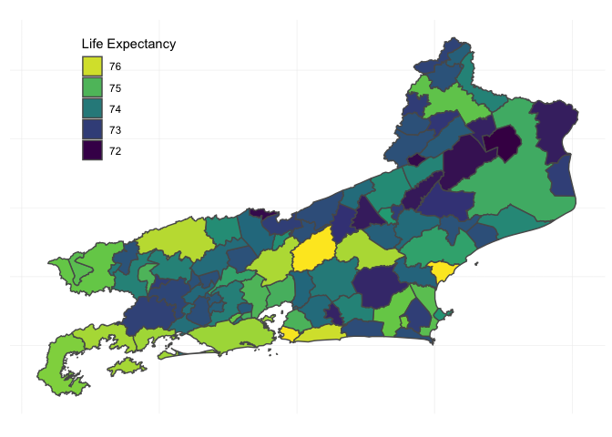
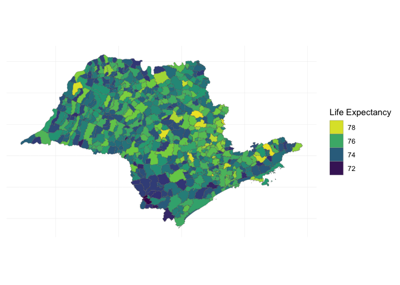
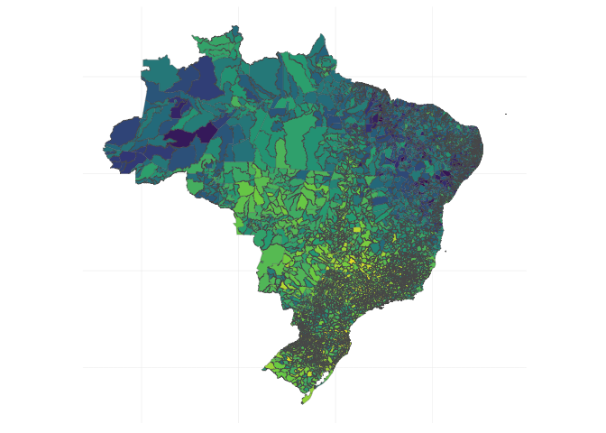

<!-- README.md is generated from README.Rmd. Please edit that file -->

# simplefeaturesbr

The goal of simplefeaturesbr is to make [Simple
Features](https://en.wikipedia.org/wiki/Simple_Features) tidy data
frames of Brazilian states and municipalities easily available in R.

## Installation

You can install simplefeaturesbr with:

``` r
remotes::install_github("BrazilianPublicData/simplefeaturesbr")
```

## Usage

simplefeaturesbr has a main dataset, `br_municipalities`, and some
simple convenience functions to select from this dataset. You can access
the data with:

``` r
library(simplefeaturesbr)
data("br_municipalities")
```

It looks like this:

``` r
head(br_municipalities)
#>              name state ibge_code
#> 1      Acrelandia    AC   1200013
#> 2    Assis Brasil    AC   1200054
#> 3       Brasileia    AC   1200104
#> 4          Bujari    AC   1200138
#> 5        Capixaba    AC   1200179
#> 6 Cruzeiro do Sul    AC   1200203
#>                                                                                                                                                                                                                                                                                                                                                                                                                                                                                                                                                                                                                                                                                                                                                                                                                                                                                                                                                                                                                                                                                                                                                                                                                                                                                                                                                                                                                                                                                                                                                                                                                                                                                                                                                                                                                                                                                                                                                                                                                                                                                                                                                                                                                                                                                                                                                                                                                                                                                                                                                                                                                                                                                                                                                                                                                                                                                                                                                                                                                                                                                                                                                                                                                                                                                                                                                                                                                                                                                                                                                                                                                                                                                                                                                                                                                                                                                                                                                                                                                                                                                                                                                                                                                                                                                                                                                                                                                                                                                                                                                                                                                                                                                                                                                                                                                                                                                                                                                                                                                                                                                                                                                                                                                                                                                                                                                                                                                                                                                                                                                                                                                                                                                                                                                                                                                                                                                                                                                                                                                                                                                                                                                                                                                                                                                                                                                                                                                                                                                                                                                                                                                                                                                                                                                                                                                                                                                                                                                                                                                                                                                                                                                                                                                                                                                                                                                                                                                                                                                                                                                                                                                                                                                                                                                                                                                                                                                                                                                                                                                                                                                                                                                                                                                                                                                                                                                                                                                                                                                                                                                                                                                                                                                                                                                                                                                                                                                                                                                                                                                                                                                                                                                                                                                                                                                                                                                                                                                                 geometry
#> 1                                                                                                                                                                                                                                                                                                                                                                                                                                                                                                                                                                                                                                                                                                                                                                                                                                                                                                                                                                                                                                                                                                                                                                                                                                                                                                                                                                                                                                                                                                                                                                                                                                                                                                                                                                                                                                                                                                                                                                                                                                                                                                                                                                                                                                                                                                                                                                                                                                                                                                                                                                                                                                                                                                                                                                                                                                                                                                                                                                                                                                                                                                                                                                                                                                                                                                                                                                                                                                                                                                                                                                                                                                                                                                                                                                                                                                                                                                                                                                                                                                                                                                                                                                                                                                                                                                                                                                                                                                                                                                                                                                                                                                                                                                                                                                                                                                                                                                                                                                                                                                                                                                                                                                                                                                                                                                                                                                                                                                                                                                                                                                                                                                                                                                                                                                                                                                                                                                                                                                                                                                                                                                                                                                                                                                                                                                                                                                                                                                                                   -67.133051, -67.059557, -66.847285, -66.809702, -66.805734, -66.644389, -66.619360, -66.626191, -66.624000, -66.635254, -66.625915, -66.632224, -66.635307, -66.626610, -66.626999, -66.632888, -66.635389, -66.637611, -66.650001, -66.651444, -66.655416, -66.657080, -66.663277, -66.666526, -66.663727, -66.669609, -66.676140, -66.675773, -66.695274, -66.694053, -66.714942, -66.717474, -66.722252, -66.720139, -66.731193, -66.733526, -66.734054, -66.741088, -66.750418, -66.755614, -66.763945, -66.763945, -66.772414, -66.771636, -66.779388, -66.789998, -66.792105, -66.806304, -66.802002, -66.807167, -66.816697, -66.822837, -66.835998, -66.834587, -66.839806, -66.838081, -66.851447, -66.851921, -66.866249, -66.872749, -66.875114, -66.870529, -66.872833, -66.880027, -66.883171, -66.887137, -66.888610, -66.895366, -66.898331, -66.896849, -66.902168, -66.910140, -66.909552, -66.914391, -66.917861, -66.917557, -66.910805, -66.911111, -66.923721, -66.933334, -66.933197, -66.938911, -66.944610, -66.953727, -66.958358, -66.956055, -66.960442, -66.968140, -66.972030, -66.975334, -66.971832, -66.974838, -66.980835, -66.974608, -66.981139, -66.991639, -66.992224, -66.995697, -66.993331, -66.999359, -66.989777, -66.988251, -66.994140, -66.997833, -67.000924, -67.002329, -67.070678, -67.075879, -67.076123, -67.076594, -67.099428, -67.124545, -67.090565, -67.166609, -67.185731, -67.192631, -67.184222, -67.168067, -67.157952, -67.139428, -67.133051, -9.676140, -9.708309, -9.801214, -9.817661, -9.814048, -9.882970, -9.893661, -9.899281, -9.906964, -9.912935, -9.921128, -9.922143, -9.926184, -9.931589, -9.935368, -9.936909, -9.941344, -9.951763, -9.945137, -9.936305, -9.941699, -9.935942, -9.939428, -9.945961, -9.948601, -9.959860, -9.956993, -9.967834, -9.967374, -9.970991, -9.978468, -9.974268, -9.979379, -9.983120, -9.980450, -9.982619, -9.988255, -9.996466, -9.994518, -10.000097, -9.999680, -10.006182, -10.011208, -10.020546, -10.017081, -10.021836, -10.026874, -10.037345, -10.042986, -10.048169, -10.051108, -10.058924, -10.063380, -10.067422, -10.071059, -10.083095, -10.086525, -10.080867, -10.084300, -10.080539, -10.082851, -10.095033, -10.100611, -10.096861, -10.107822, -10.099098, -10.114289, -10.110114, -10.111623, -10.118087, -10.126469, -10.125698, -10.131878, -10.129037, -10.131053, -10.134821, -10.138769, -10.147381, -10.143113, -10.147503, -10.155581, -10.154081, -10.157481, -10.189211, -10.190705, -10.187759, -10.182816, -10.191871, -10.191926, -10.190019, -10.186983, -10.185631, -10.189955, -10.196140, -10.195664, -10.203639, -10.199363, -10.199316, -10.210183, -10.217206, -10.217378, -10.220927, -10.223711, -10.232343, -10.229912, -10.216668, -10.202429, -10.196421, -10.110371, -10.090584, -10.103395, -9.970747, -9.956514, -9.760112, -9.710174, -9.704213, -9.695389, -9.687826, -9.689840, -9.683383, -9.676140
#> 2 -69.58777, -69.58226, -69.57949, -69.56730, -69.56276, -69.55426, -69.54852, -69.54186, -69.53979, -69.54533, -69.53607, -69.53785, -69.53378, -69.53417, -69.50787, -69.51088, -69.55017, -69.58780, -69.65212, -69.66107, -69.67053, -69.75677, -69.77791, -69.76646, -69.74382, -69.74123, -69.73161, -69.72775, -69.71597, -69.69227, -69.68487, -69.67472, -69.66668, -69.66691, -69.66144, -69.66401, -69.65682, -69.64772, -69.64181, -69.64288, -69.63463, -69.62477, -69.61211, -69.60641, -69.59894, -69.59238, -69.58618, -69.58107, -69.57581, -69.56653, -69.56215, -69.55509, -69.55206, -69.52086, -69.50050, -69.48481, -69.48551, -69.49787, -69.49793, -69.49247, -69.48481, -69.47721, -69.47382, -69.46566, -69.43987, -69.43004, -69.42197, -69.42358, -69.39272, -69.39158, -69.39004, -69.42137, -69.42758, -69.44967, -69.45405, -69.46022, -69.46203, -69.47256, -69.47708, -69.47611, -69.47992, -69.48350, -69.49564, -69.50020, -69.50741, -69.51697, -69.53861, -69.54250, -69.54119, -69.54605, -69.55114, -69.55403, -69.56508, -69.57513, -69.58855, -69.58403, -69.58625, -69.60172, -69.61159, -69.61228, -69.62000, -69.63512, -69.65897, -69.66917, -69.67850, -69.68770, -69.69136, -69.69769, -69.70111, -69.71625, -69.72283, -69.73653, -69.74109, -69.73952, -69.74609, -69.74786, -69.75984, -69.76411, -69.76058, -69.77317, -69.76903, -69.78108, -69.78871, -69.79550, -69.80050, -69.81047, -69.81391, -69.83097, -69.83359, -69.83236, -69.83916, -69.85152, -69.85797, -69.86291, -69.87469, -69.87903, -69.89983, -69.91414, -69.91661, -69.92186, -69.92550, -69.93442, -69.95345, -69.95456, -69.96206, -69.95859, -69.96394, -69.97347, -69.98222, -69.98525, -69.99389, -69.99800, -70.00350, -70.00631, -70.00819, -70.01334, -70.02608, -70.02786, -70.03647, -70.03714, -70.04745, -70.04367, -70.04978, -70.05214, -70.06525, -70.06406, -70.06722, -70.07697, -70.07931, -70.08044, -70.08625, -70.09192, -70.09791, -70.10508, -70.09830, -70.10839, -70.10700, -70.11117, -70.11647, -70.11405, -70.12256, -70.13197, -70.13892, -70.14183, -70.15583, -70.15869, -70.16472, -70.16728, -70.16950, -70.17245, -70.17669, -70.17983, -70.19005, -70.18970, -70.19992, -70.21178, -70.21477, -70.22836, -70.23042, -70.24136, -70.25875, -70.26405, -70.27153, -70.28030, -70.28584, -70.29350, -70.30672, -70.32653, -70.33581, -70.34966, -70.35336, -70.37403, -70.38541, -70.39897, -70.40611, -70.41023, -70.42416, -70.43142, -70.43675, -70.44055, -70.43733, -70.44952, -70.46917, -70.47950, -70.48639, -70.49445, -70.50447, -70.51466, -70.51945, -70.53033, -70.62102, -70.62286, -70.61852, -70.61333, -70.60497, -70.60239, -70.57840, -70.57077, -70.56231, -70.55545, -70.53737, -70.53323, -70.52369, -70.53556, -70.53457, -70.52487, -70.51488, -70.51037, -70.50339, -70.50299, -70.49733, -70.48500, -70.48143, -70.48200, -70.47128, -70.46597, -70.46486, -70.46189, -70.45591, -70.45838, -70.44585, -70.44396, -70.43502, -70.42272, -70.42480, -70.41962, -70.41989, -70.41321, -70.40677, -70.40437, -70.39568, -70.38396, -70.38117, -70.36798, -70.36354, -70.34967, -70.34843, -70.34334, -70.34353, -70.33410, -70.32996, -70.32529, -70.31513, -70.31198, -70.30113, -70.29857, -70.29169, -70.28215, -70.28039, -70.27558, -70.27305, -70.26531, -70.26021, -70.25496, -70.25191, -70.22701, -70.23460, -70.22295, -70.22396, -70.21897, -70.21278, -70.21853, -70.21382, -70.20691, -70.20686, -70.20038, -70.18965, -70.18451, -70.17963, -70.17613, -70.17945, -70.17375, -70.17869, -70.17135, -70.17206, -70.16596, -70.16448, -70.16188, -70.15704, -70.15057, -70.14497, -70.14445, -70.14006, -70.13159, -70.13148, -70.12295, -70.12542, -70.12256, -70.11087, -70.10004, -70.09851, -70.08981, -70.07942, -70.07040, -70.07000, -70.06593, -70.05707, -70.05265, -70.04331, -70.04385, -70.03664, -70.03668, -70.03063, -70.01990, -70.01720, -70.01678, -70.01070, -70.00831, -69.99619, -69.99804, -69.99192, -69.98098, -69.97520, -69.96851, -69.96103, -69.94115, -69.92906, -69.92377, -69.92493, -69.92112, -69.90619, -69.90066, -69.89720, -69.88864, -69.87816, -69.86241, -69.84899, -69.83150, -69.82737, -69.83150, -69.81898, -69.80750, -69.80035, -69.79912, -69.80430, -69.80467, -69.79760, -69.78708, -69.78519, -69.77476, -69.76689, -69.75769, -69.75394, -69.74597, -69.74384, -69.72719, -69.71131, -69.70959, -69.70405, -69.69542, -69.69137, -69.68730, -69.68412, -69.68214, -69.67700, -69.66958, -69.66390, -69.65682, -69.64799, -69.64844, -69.63737, -69.64548, -69.64198, -69.62915, -69.62989, -69.62375, -69.61337, -69.61505, -69.60674, -69.59995, -69.59227, -69.58777, -10.37119, -10.37989, -10.37805, -10.38876, -10.38887, -10.39855, -10.41454, -10.41803, -10.42882, -10.44873, -10.45778, -10.46888, -10.47543, -10.48267, -10.50499, -10.55650, -10.61442, -10.64270, -10.68966, -10.70991, -10.73128, -10.74343, -10.78187, -10.79163, -10.80845, -10.81654, -10.82177, -10.82876, -10.82416, -10.83078, -10.82738, -10.83609, -10.83681, -10.84077, -10.84550, -10.85887, -10.86265, -10.85258, -10.85068, -10.84728, -10.84529, -10.85340, -10.85574, -10.86022, -10.85823, -10.86331, -10.86343, -10.85798, -10.85997, -10.85651, -10.86352, -10.86532, -10.87315, -10.84818, -10.82177, -10.79383, -10.78304, -10.74923, -10.70007, -10.69725, -10.70173, -10.70108, -10.70975, -10.71030, -10.70102, -10.70178, -10.69070, -10.71339, -10.73208, -10.80081, -10.82626, -10.92678, -10.93700, -10.93608, -10.94980, -10.94392, -10.95011, -10.94475, -10.94556, -10.95267, -10.95457, -10.95105, -10.94942, -10.93683, -10.94156, -10.93563, -10.93577, -10.93825, -10.95050, -10.95218, -10.95119, -10.94553, -10.94383, -10.94239, -10.94047, -10.94559, -10.94754, -10.94189, -10.94680, -10.95553, -10.95019, -10.95716, -10.95200, -10.96196, -10.95986, -10.96455, -10.96345, -10.97169, -10.96550, -10.97446, -10.96476, -10.97445, -10.97232, -10.96381, -10.96190, -10.95369, -10.93980, -10.93910, -10.94480, -10.93900, -10.92972, -10.93437, -10.93079, -10.93244, -10.92615, -10.92527, -10.93015, -10.93359, -10.93255, -10.92808, -10.92884, -10.92433, -10.93351, -10.92617, -10.92906, -10.92389, -10.92009, -10.92301, -10.93099, -10.93233, -10.92367, -10.92190, -10.92717, -10.93511, -10.93450, -10.93986, -10.93984, -10.94767, -10.94236, -10.95417, -10.95080, -10.96316, -10.95980, -10.96447, -10.96177, -10.96726, -10.97114, -10.97723, -10.97024, -10.97776, -10.97850, -10.98282, -10.97957, -10.98539, -10.98654, -10.99090, -10.99250, -10.98860, -10.99079, -10.98402, -10.98904, -10.98596, -10.99768, -10.99736, -10.99207, -10.99455, -11.00697, -11.00267, -11.00539, -11.00867, -11.01015, -11.02144, -11.02144, -11.02960, -11.03391, -11.04096, -11.03811, -11.04211, -11.03960, -11.04172, -11.03882, -11.04326, -11.04462, -11.04846, -11.05360, -11.04938, -11.05207, -11.04876, -11.05249, -11.04602, -11.05247, -11.05082, -11.05976, -11.05617, -11.05771, -11.06548, -11.06983, -11.06529, -11.06778, -11.06463, -11.05864, -11.06045, -11.04732, -11.04457, -11.04750, -11.04182, -11.03814, -11.03991, -11.03923, -11.03349, -11.02738, -11.00082, -10.98864, -10.97118, -10.96429, -10.96344, -10.95184, -10.94828, -10.94067, -10.93465, -10.99982, -10.71124, -10.71408, -10.70645, -10.70344, -10.69693, -10.70280, -10.69117, -10.69384, -10.68807, -10.69211, -10.69955, -10.70295, -10.70577, -10.71283, -10.72084, -10.72005, -10.72690, -10.72256, -10.71436, -10.71996, -10.72385, -10.72315, -10.71734, -10.71559, -10.71777, -10.70228, -10.70085, -10.70268, -10.71266, -10.71170, -10.72284, -10.71457, -10.72408, -10.71647, -10.70811, -10.71463, -10.71607, -10.71541, -10.72189, -10.72689, -10.71899, -10.73043, -10.73007, -10.71219, -10.71088, -10.71687, -10.71659, -10.70522, -10.70717, -10.71635, -10.71266, -10.71402, -10.70104, -10.70019, -10.69537, -10.69939, -10.69145, -10.70562, -10.70718, -10.69528, -10.71283, -10.70628, -10.71306, -10.69788, -10.68980, -10.68533, -10.68493, -10.67642, -10.68275, -10.68078, -10.68578, -10.69687, -10.69513, -10.70342, -10.68976, -10.69246, -10.68894, -10.68995, -10.69001, -10.68445, -10.68294, -10.67777, -10.67289, -10.66717, -10.66792, -10.66286, -10.66375, -10.67600, -10.66476, -10.66856, -10.66019, -10.66166, -10.65807, -10.65195, -10.65512, -10.64191, -10.63766, -10.64406, -10.64120, -10.64732, -10.64936, -10.63258, -10.63341, -10.61402, -10.61234, -10.61623, -10.60659, -10.61250, -10.60413, -10.61115, -10.60117, -10.59145, -10.59414, -10.59182, -10.58514, -10.59144, -10.58163, -10.58311, -10.57619, -10.57025, -10.58316, -10.58261, -10.57426, -10.57767, -10.56638, -10.54839, -10.54897, -10.55653, -10.55936, -10.54330, -10.54678, -10.55661, -10.55188, -10.55779, -10.53843, -10.54024, -10.53787, -10.51341, -10.50745, -10.50869, -10.50413, -10.50890, -10.50262, -10.49222, -10.47975, -10.48146, -10.47142, -10.46088, -10.45527, -10.45956, -10.45886, -10.45130, -10.45228, -10.44657, -10.45329, -10.44576, -10.43820, -10.43298, -10.43139, -10.43647, -10.43519, -10.43270, -10.40999, -10.42416, -10.41889, -10.42470, -10.42045, -10.42808, -10.41658, -10.40820, -10.40323, -10.40090, -10.40345, -10.39485, -10.39103, -10.39423, -10.38451, -10.37901, -10.38042, -10.36974, -10.37119
#> 3                                                                                                                                                                                                                                                                                                                                                                                                                                                                                                                                                                                                                                                                                                                                                                                                                                                                                                                                                                                                                                                                                                                                                                                                                                                                                                                                                                                                                                                                                                                                                                                                                                                                                                                                                                                                                                                                                                                                                                     -69.12877, -69.13691, -69.14129, -69.13970, -69.14769, -69.15731, -69.16842, -69.16907, -69.16283, -69.16485, -69.16199, -69.13346, -69.11793, -69.10630, -69.10115, -69.08489, -69.08082, -69.08095, -69.07192, -69.07126, -69.06025, -69.05409, -69.03580, -69.03396, -69.02509, -69.02166, -69.00078, -68.99699, -68.98104, -68.97858, -68.97096, -68.96432, -68.95898, -68.95773, -68.95593, -68.95126, -68.94537, -68.94454, -68.94256, -68.93334, -68.92919, -68.92837, -68.92208, -68.91901, -68.91796, -68.91415, -68.91670, -68.90756, -68.90379, -68.90224, -68.91106, -68.90791, -68.91040, -68.91441, -68.91646, -68.92061, -68.92552, -68.92445, -68.91545, -68.91851, -68.93182, -68.94171, -68.94496, -68.94840, -68.94549, -68.94947, -68.94750, -68.95615, -68.95609, -68.96610, -68.97618, -68.98019, -68.97545, -68.94094, -68.92848, -68.92190, -68.91418, -68.90661, -68.89833, -68.89541, -68.88066, -68.87753, -68.85351, -68.83512, -68.81109, -68.81205, -68.80476, -68.80496, -68.80003, -68.78644, -68.78445, -68.77558, -68.77190, -68.73445, -68.72995, -68.72263, -68.71446, -68.70384, -68.68704, -68.68392, -68.68710, -68.71628, -68.72544, -68.72355, -68.72659, -68.71680, -68.72331, -68.72671, -68.73308, -68.73398, -68.73721, -68.74062, -68.74284, -68.73911, -68.73930, -68.73675, -68.74281, -68.74961, -68.74790, -68.75461, -68.76211, -68.76278, -68.75678, -68.75767, -68.76994, -68.77930, -68.77825, -68.78097, -68.78683, -68.78792, -68.78922, -68.79825, -68.79156, -68.79880, -68.80200, -68.81189, -68.80386, -68.81206, -68.81595, -68.82313, -68.82844, -68.83103, -68.82667, -68.83410, -68.84077, -68.84447, -68.84099, -68.84206, -68.84764, -68.85953, -68.86044, -68.86967, -68.87397, -68.88186, -68.88514, -68.88033, -68.88000, -68.87600, -68.88123, -68.89536, -68.90825, -68.91180, -68.92108, -68.92467, -68.93425, -68.94720, -68.94739, -68.95631, -68.95275, -68.96050, -68.96797, -68.97334, -68.98128, -68.98764, -68.98417, -68.99456, -68.99458, -69.00020, -69.01297, -69.01547, -69.01056, -69.01173, -69.02458, -69.02558, -69.03319, -69.03867, -69.04675, -69.05025, -69.06139, -69.07233, -69.07792, -69.08595, -69.10136, -69.11103, -69.12061, -69.12219, -69.13658, -69.13780, -69.14247, -69.14861, -69.14994, -69.14411, -69.15417, -69.15247, -69.16355, -69.18092, -69.18567, -69.19872, -69.21486, -69.21917, -69.23189, -69.24075, -69.25642, -69.25694, -69.25056, -69.25072, -69.27053, -69.27402, -69.27103, -69.27395, -69.28294, -69.28839, -69.29772, -69.30436, -69.31928, -69.32377, -69.32716, -69.33436, -69.33642, -69.34267, -69.34647, -69.34583, -69.35603, -69.35675, -69.37228, -69.37422, -69.37695, -69.37853, -69.38528, -69.38756, -69.39430, -69.39167, -69.39474, -69.40153, -69.40603, -69.41292, -69.41561, -69.42137, -69.39004, -69.39158, -69.39272, -69.42358, -69.42197, -69.43004, -69.43987, -69.46566, -69.47382, -69.47721, -69.48481, -69.49247, -69.49793, -69.49787, -69.48551, -69.48481, -69.50050, -69.52086, -69.55206, -69.55509, -69.56215, -69.56653, -69.57581, -69.58107, -69.58618, -69.59238, -69.59894, -69.60641, -69.61211, -69.62477, -69.63463, -69.64288, -69.64181, -69.64772, -69.65682, -69.66401, -69.66144, -69.66691, -69.66668, -69.67472, -69.68487, -69.69227, -69.71597, -69.72775, -69.73161, -69.74123, -69.74382, -69.76646, -69.77791, -69.75677, -69.67053, -69.66107, -69.65212, -69.58780, -69.55017, -69.51088, -69.50787, -69.34182, -69.32345, -69.31341, -69.30791, -69.28920, -69.26914, -69.24881, -69.24636, -69.22603, -69.22082, -69.21322, -69.21114, -69.19566, -69.19384, -69.18841, -69.18254, -69.17013, -69.15165, -69.14939, -69.13165, -69.12877, -10.40171, -10.42173, -10.42485, -10.43504, -10.44371, -10.46721, -10.47682, -10.48141, -10.49178, -10.50225, -10.50965, -10.51441, -10.52464, -10.53667, -10.55411, -10.55951, -10.57559, -10.57876, -10.58234, -10.58605, -10.59022, -10.58374, -10.58336, -10.58781, -10.59008, -10.58505, -10.58673, -10.57950, -10.57830, -10.57464, -10.58402, -10.57929, -10.58095, -10.58481, -10.58043, -10.58210, -10.57897, -10.58204, -10.57772, -10.58033, -10.57592, -10.57926, -10.57808, -10.58114, -10.57771, -10.57742, -10.57917, -10.58310, -10.57955, -10.58399, -10.59825, -10.60282, -10.60609, -10.60531, -10.61425, -10.61221, -10.61587, -10.62629, -10.63639, -10.64407, -10.67641, -10.67936, -10.67426, -10.67655, -10.69190, -10.70273, -10.71127, -10.71977, -10.72945, -10.73917, -10.74091, -10.75202, -10.77137, -10.77809, -10.77643, -10.77984, -10.77582, -10.77696, -10.77468, -10.77016, -10.76684, -10.75802, -10.75794, -10.73960, -10.78268, -10.78861, -10.79511, -10.80419, -10.80747, -10.83321, -10.86881, -10.87468, -10.87712, -10.89673, -10.90558, -10.90755, -10.91778, -10.92120, -10.93708, -10.95531, -10.96793, -10.97742, -10.97226, -10.97566, -10.98191, -10.99051, -10.99265, -11.00186, -10.99359, -10.98672, -10.99217, -10.99111, -10.99638, -11.00060, -11.00798, -11.01178, -11.01637, -11.02015, -11.01058, -11.01154, -11.01922, -11.01277, -11.00960, -11.00079, -11.00796, -11.00516, -11.00010, -10.99950, -11.00626, -11.01548, -11.00079, -10.99859, -10.99094, -10.99137, -10.99566, -10.99509, -11.00204, -11.00162, -11.00583, -11.00364, -11.00819, -11.00168, -10.99704, -10.99444, -11.00293, -10.99887, -10.99704, -10.99414, -10.99335, -11.00532, -11.01789, -11.01525, -11.00987, -11.00978, -11.01641, -11.01725, -11.01254, -11.02013, -11.02229, -11.00667, -11.02167, -11.02192, -11.01461, -11.01795, -11.00534, -11.01261, -11.00500, -11.00155, -10.98949, -10.99316, -10.98834, -10.98924, -10.99732, -10.99829, -11.00896, -11.01082, -11.00369, -11.00727, -11.00491, -11.00201, -10.99555, -10.99162, -10.99142, -10.98334, -10.98525, -10.97686, -10.98129, -10.97468, -10.98432, -10.96593, -10.97463, -10.97026, -10.98004, -10.97147, -10.98030, -10.96691, -10.97331, -10.96463, -10.97004, -10.97118, -10.96868, -10.96318, -10.96419, -10.95508, -10.96523, -10.95588, -10.94844, -10.94806, -10.95693, -10.94922, -10.93987, -10.95106, -10.94691, -10.94419, -10.94328, -10.93964, -10.94189, -10.94556, -10.95305, -10.95433, -10.94338, -10.95011, -10.94679, -10.94798, -10.94393, -10.93642, -10.94905, -10.94682, -10.94080, -10.95212, -10.94724, -10.93833, -10.93715, -10.94443, -10.93918, -10.95355, -10.95219, -10.94102, -10.94204, -10.93384, -10.93456, -10.94303, -10.94384, -10.92967, -10.92941, -10.93846, -10.92717, -10.92678, -10.82626, -10.80081, -10.73208, -10.71339, -10.69070, -10.70178, -10.70102, -10.71030, -10.70975, -10.70108, -10.70173, -10.69725, -10.70007, -10.74923, -10.78304, -10.79383, -10.82177, -10.84818, -10.87315, -10.86532, -10.86352, -10.85651, -10.85997, -10.85798, -10.86343, -10.86331, -10.85823, -10.86022, -10.85574, -10.85340, -10.84529, -10.84728, -10.85068, -10.85258, -10.86265, -10.85887, -10.84550, -10.84077, -10.83681, -10.83609, -10.82738, -10.83078, -10.82416, -10.82876, -10.82177, -10.81654, -10.80845, -10.79163, -10.78187, -10.74343, -10.73128, -10.70991, -10.68966, -10.64270, -10.61442, -10.55650, -10.50499, -10.48531, -10.47229, -10.47397, -10.47047, -10.47059, -10.45864, -10.45491, -10.43639, -10.42361, -10.41518, -10.41827, -10.41498, -10.41259, -10.40653, -10.40724, -10.39882, -10.40235, -10.39903, -10.38502, -10.38502, -10.40171
#> 4                                                                                                                                                                                                                                                                                                                                                                                                                                                                                                                                                                                                                                                                                                                                                                                                                                                                                                                                                                                                                                                                                                                                                                                                                                                                                                                                                                                                                                                                                                                                                                                                                                                                                                                                                                                                                                                                                                                                                                                                                                                                                                                                                                                                                                                                                                                                                                                                                                                                                                                                                                                                                                                                                                                                                                                                                                                                                                                                                                                                                                                                                                                                                                                                                                                                                                                                                                                                                                                                                                                                                                                                                                                                                                                                                                                                                                                                                                                                                                                                                                                                                                                                                                                                                                                                                                                                                                                                                                                                                                                                                                                                                                                                                                                                                                                                                                                                                                                                                                                                                                                                                                                                                                                                                                                                                                                                                                                                                                                                                                                                                                                                                                                                                                                                                                                                                                                                                                                                                                                                                                                                                                            -68.219789, -67.976635, -67.974457, -67.983414, -67.988986, -67.998309, -68.008013, -68.020021, -68.022909, -68.020688, -68.032474, -68.032707, -68.035893, -68.037674, -68.038725, -68.042339, -68.048347, -68.049716, -68.051822, -68.061807, -68.059380, -68.038496, -68.033443, -68.027108, -68.019406, -68.022226, -68.032836, -68.045734, -68.065729, -68.074551, -68.088853, -68.013073, -67.990860, -67.981111, -67.909452, -67.880167, -67.872955, -67.867514, -67.833843, -67.804227, -67.796450, -67.814925, -67.827412, -67.821930, -67.831287, -67.834816, -67.825364, -67.829809, -67.844224, -67.853027, -67.860257, -67.866829, -67.901550, -67.905547, -67.918821, -67.922759, -67.922961, -67.926346, -67.933129, -67.948889, -67.965133, -67.975508, -67.994993, -68.039344, -68.046728, -68.054464, -68.069183, -68.074396, -68.085651, -68.088549, -68.100772, -68.123118, -68.135444, -68.150590, -68.151990, -68.169115, -68.269721, -68.274613, -68.291197, -68.299841, -68.325294, -68.331856, -68.342850, -68.348991, -68.367011, -68.379847, -68.392040, -68.392311, -68.396214, -68.414916, -68.423865, -68.427859, -68.441914, -68.428360, -68.427255, -68.431320, -68.433833, -68.442417, -68.441108, -68.450667, -68.454873, -68.444368, -68.427611, -68.429149, -68.422400, -68.424824, -68.418174, -68.411224, -68.410194, -68.414255, -68.410959, -68.406446, -68.396066, -68.389155, -68.386132, -68.382019, -68.368079, -68.354400, -68.352625, -68.342979, -68.343712, -68.338463, -68.336154, -68.331714, -68.335256, -68.330059, -68.400688, -68.365669, -68.352806, -68.344307, -68.315780, -68.294524, -68.287888, -68.276107, -68.269541, -68.251556, -68.241669, -68.227142, -68.219789, -9.242153, -9.352191, -9.353176, -9.356160, -9.352920, -9.358473, -9.352037, -9.356658, -9.354199, -9.349112, -9.343964, -9.349638, -9.347280, -9.349800, -9.346843, -9.351243, -9.352246, -9.360242, -9.371348, -9.389627, -9.417082, -9.434717, -9.442862, -9.444468, -9.469797, -9.480546, -9.494520, -9.500737, -9.518607, -9.521859, -9.553804, -9.605562, -9.627119, -9.636580, -9.709245, -9.717583, -9.730876, -9.733065, -9.749859, -9.747289, -9.761627, -9.767604, -9.781636, -9.794053, -9.807252, -9.826192, -9.848392, -9.869735, -9.859605, -9.858086, -9.845048, -9.841405, -9.842398, -9.845818, -9.846325, -9.850542, -9.850716, -9.853630, -9.849107, -9.853649, -9.853648, -9.847026, -9.860648, -9.883473, -9.891163, -9.888207, -9.895529, -9.903451, -9.909729, -9.920562, -9.930187, -9.938519, -9.934196, -9.953105, -9.959941, -9.941069, -9.830223, -9.824835, -9.807875, -9.794007, -9.788807, -9.783212, -9.782610, -9.785738, -9.780468, -9.782089, -9.788965, -9.798045, -9.804276, -9.810591, -9.817985, -9.826341, -9.827115, -9.719374, -9.710568, -9.675010, -9.666248, -9.656344, -9.638809, -9.631651, -9.623689, -9.608973, -9.598851, -9.585659, -9.567761, -9.558645, -9.544727, -9.540870, -9.537140, -9.533373, -9.520719, -9.519271, -9.499653, -9.499435, -9.502449, -9.496014, -9.497133, -9.488690, -9.482607, -9.473793, -9.465169, -9.466383, -9.459291, -9.457148, -9.449611, -9.439758, -9.323944, -9.297753, -9.295816, -9.289606, -9.292361, -9.283699, -9.284573, -9.276467, -9.264754, -9.264435, -9.252232, -9.248093, -9.242153
#> 5                                                                                                                                                                                                                                                                                                                                                                                                                                                                                                                                                                                                                                                                                                                                                                                                                                                                                                                                                                                                                                                                                                                                                                                                                                                                                                                                                                                                                                                                                                                                                                                                                                                                                                                                                                                                                                                                                                                                                                                                                                                                                                                                                                                                                                                                                                                                                                                                                                                                                                                                                                                                                                                                                                                                                                                                                                                                                                                                                                                                                                                                                                                                                                                                                                                                                                                                                                                                                                                                                                                                                                                                                                                                                                                                                                                                                                                                                                                                                                                                                                                                                                                                                                                                                                                                                                                                                                                                                                                                                                                                                                                                                                                                                                                                                                                                                                                                                                                                                                                                                                                                                                                                                                                                                                                                                                                                                                                                                                                                                                                                                                                                                                                                                                                                                                                                                                                                                                             -67.77317, -67.77008, -67.76486, -67.76314, -67.75589, -67.74453, -67.71617, -67.69525, -67.69490, -67.68877, -67.68388, -67.63742, -67.64613, -67.65803, -67.66739, -67.67973, -67.68725, -67.69557, -67.70578, -67.69605, -67.69633, -67.68752, -67.68025, -67.66337, -67.65869, -67.62447, -67.61303, -67.60580, -67.59675, -67.58747, -67.60687, -67.61203, -67.63358, -67.64027, -67.66011, -67.67631, -67.70485, -67.70711, -67.71375, -67.72089, -67.72575, -67.72869, -67.73280, -67.74375, -67.74411, -67.75291, -67.76153, -67.76845, -67.77553, -67.77600, -67.78680, -67.78731, -67.79159, -67.79817, -67.80348, -67.80775, -67.81022, -67.81489, -67.81803, -67.82317, -67.82520, -67.83653, -67.84200, -67.85181, -67.85456, -67.85808, -67.86386, -67.87653, -67.87581, -67.87878, -67.89161, -67.88972, -67.89486, -67.89861, -67.90806, -67.91686, -67.92286, -67.92892, -67.94125, -67.94661, -67.94650, -67.96089, -67.97613, -68.00194, -68.00285, -68.00884, -68.00961, -68.01615, -68.00803, -67.98349, -68.01738, -68.01799, -68.03094, -68.03315, -68.02994, -68.03681, -68.04201, -68.04299, -68.04304, -68.06391, -68.05384, -68.05571, -68.04748, -68.04583, -68.04073, -68.03078, -68.02624, -68.02463, -68.03481, -68.03823, -68.02779, -68.02878, -68.01456, -68.00879, -67.99851, -67.98211, -67.97129, -67.96910, -67.96001, -67.95439, -67.95085, -67.95280, -67.94841, -67.94625, -67.85611, -67.84715, -67.84252, -67.84386, -67.85591, -67.84640, -67.84234, -67.83300, -67.81778, -67.81909, -67.82978, -67.83256, -67.82990, -67.82372, -67.82086, -67.81512, -67.81727, -67.81221, -67.81731, -67.82604, -67.82708, -67.82362, -67.80413, -67.80414, -67.80136, -67.79992, -67.78428, -67.78380, -67.77903, -67.77317, -10.24188, -10.24938, -10.25140, -10.26174, -10.27066, -10.27431, -10.29157, -10.32451, -10.34114, -10.35384, -10.35643, -10.36337, -10.38965, -10.39795, -10.39098, -10.39058, -10.41169, -10.41650, -10.43348, -10.43955, -10.45287, -10.45275, -10.46247, -10.47282, -10.48028, -10.47957, -10.49028, -10.50388, -10.50964, -10.50994, -10.54497, -10.56359, -10.57907, -10.59807, -10.61627, -10.60484, -10.69800, -10.71045, -10.70766, -10.71178, -10.70682, -10.71327, -10.71342, -10.70768, -10.69653, -10.69594, -10.68461, -10.68797, -10.68410, -10.68024, -10.67765, -10.67466, -10.67770, -10.66996, -10.66851, -10.66753, -10.66094, -10.66530, -10.66375, -10.65212, -10.65382, -10.64946, -10.65256, -10.64764, -10.64997, -10.64582, -10.64067, -10.64429, -10.63962, -10.63942, -10.64050, -10.64390, -10.64735, -10.64311, -10.64141, -10.65227, -10.65058, -10.65598, -10.65599, -10.65039, -10.65252, -10.65002, -10.66260, -10.64796, -10.64100, -10.63363, -10.61208, -10.60223, -10.60033, -10.59296, -10.56498, -10.55067, -10.53609, -10.52481, -10.51518, -10.48930, -10.48384, -10.47314, -10.47255, -10.42498, -10.42082, -10.41156, -10.40452, -10.39367, -10.38892, -10.37891, -10.37852, -10.37242, -10.36406, -10.35113, -10.34395, -10.34061, -10.33485, -10.32314, -10.31567, -10.31724, -10.31503, -10.31191, -10.31418, -10.30708, -10.30730, -10.30269, -10.30028, -10.28750, -10.28750, -10.28750, -10.28296, -10.27972, -10.28438, -10.27049, -10.26927, -10.27437, -10.26656, -10.26201, -10.25854, -10.24811, -10.24341, -10.24418, -10.23722, -10.23347, -10.22542, -10.22468, -10.21559, -10.21350, -10.21023, -10.20684, -10.20356, -10.19831, -10.19868, -10.20849, -10.21299, -10.23096, -10.24040, -10.24188
#> 6                                                                                                                                                                                                                                                                                                                                                                                                                                                                                                                                                                                                                                                                       -71.989185, -71.989038, -71.983698, -71.978493, -71.983932, -71.985336, -71.989357, -71.989755, -71.995960, -71.997919, -72.004105, -72.000009, -72.001338, -71.991815, -71.995182, -71.993063, -71.998487, -71.995775, -72.006980, -72.012017, -72.017253, -72.020916, -72.017971, -72.024260, -72.017359, -72.023608, -72.024264, -72.026986, -72.031239, -72.028065, -72.031350, -72.029166, -72.035099, -72.035101, -72.045221, -72.051725, -72.047385, -72.058759, -72.068748, -72.089926, -72.097504, -72.106718, -72.133111, -72.151276, -72.160877, -72.179231, -72.184724, -72.197666, -72.206315, -72.214045, -72.218542, -72.223934, -72.232247, -72.234944, -72.233315, -72.237389, -72.248134, -72.258303, -72.264538, -72.278093, -72.287404, -72.301867, -72.322127, -72.330007, -72.333436, -72.357707, -72.363539, -72.380189, -72.396629, -72.407600, -72.421937, -72.429129, -72.432482, -72.456489, -72.463145, -72.469253, -72.502763, -72.515886, -72.518700, -72.525353, -72.526591, -72.533185, -72.534195, -72.537053, -72.535964, -72.545610, -72.541738, -72.555646, -72.570119, -72.634021, -72.675160, -72.679748, -72.687425, -72.691970, -72.701802, -72.709304, -72.712292, -72.719210, -72.729251, -72.738938, -72.748796, -72.749189, -72.754324, -72.752290, -72.759647, -72.794149, -72.795932, -72.793279, -72.796268, -72.793068, -72.807423, -72.803990, -72.808257, -72.825395, -72.825676, -72.827766, -72.831614, -72.831397, -72.846475, -72.856662, -72.857498, -72.855011, -72.861154, -72.861169, -72.865685, -72.864226, -72.868379, -72.866471, -72.877709, -72.893036, -72.908004, -72.920736, -72.921789, -72.927830, -72.925362, -72.936948, -72.943848, -72.943739, -72.948606, -72.958361, -72.964446, -72.967154, -72.971226, -72.974121, -72.977032, -72.980837, -72.984118, -72.992692, -72.999348, -73.000593, -72.999563, -73.010075, -73.010696, -73.022276, -73.038267, -73.067246, -73.085734, -73.100531, -73.132064, -73.176319, -73.200068, -73.219756, -73.240353, -73.330673, -73.335860, -73.347663, -73.365555, -73.375137, -73.377274, -73.382308, -73.389556, -73.402198, -73.407217, -73.412865, -73.422058, -73.429253, -73.443001, -73.458526, -73.482498, -73.486556, -73.486389, -73.504723, -73.516715, -73.537444, -73.530166, -73.540611, -73.536896, -73.550949, -73.558585, -73.560744, -73.572135, -73.578058, -73.579864, -73.594253, -73.586967, -73.585831, -73.591751, -73.583419, -73.594446, -73.607552, -73.616426, -73.631576, -73.629581, -73.424069, -73.397452, -73.398549, -73.389794, -73.387356, -73.374225, -73.368438, -73.358311, -73.342458, -73.330876, -73.327597, -73.320777, -73.292204, -73.264840, -73.257627, -73.248993, -73.237714, -73.232685, -73.212178, -73.203621, -73.199555, -73.183974, -73.169204, -73.163760, -73.153531, -73.134217, -73.130728, -73.107211, -73.104144, -73.092134, -73.105214, -73.105940, -73.116086, -73.115142, -73.096711, -73.088619, -73.074531, -73.052786, -73.043879, -73.032473, -72.996509, -72.993238, -72.967431, -72.962909, -72.948108, -72.926990, -72.923069, -72.893887, -72.878100, -72.875361, -72.865446, -72.853017, -72.849557, -72.839617, -72.836852, -72.832645, -72.821088, -72.810048, -72.806044, -72.803724, -72.803005, -72.797206, -72.795395, -72.781813, -72.777926, -72.768455, -72.764878, -72.760269, -72.756108, -72.749103, -72.746025, -72.749033, -72.742773, -72.741311, -72.727786, -72.725914, -72.735117, -72.725719, -72.720994, -72.714683, -72.709826, -72.702474, -72.717275, -72.716697, -72.700754, -72.692942, -72.691187, -72.685339, -72.688560, -72.679548, -72.661388, -72.658752, -72.645627, -72.641330, -72.616086, -72.616373, -72.625224, -72.628102, -72.632682, -72.638798, -72.645836, -72.636657, -72.620759, -72.612941, -72.608619, -72.612369, -72.641701, -72.625303, -72.624954, -72.644846, -72.644494, -72.644414, -72.640488, -72.644021, -72.650514, -72.652854, -72.723744, -72.730682, -72.733671, -72.747750, -72.780161, -72.805927, -72.806833, -72.806992, -72.860115, -72.853582, -72.847165, -72.841940, -72.811340, -72.805786, -72.791736, -72.782893, -72.840767, -72.843826, -72.839910, -72.840606, -72.847485, -72.846250, -72.850619, -72.861939, -72.859037, -72.864670, -72.865437, -72.871509, -72.870478, -72.877087, -72.888117, -72.900611, -72.600081, -72.592429, -72.588009, -72.584193, -72.364303, -72.168961, -72.077090, -71.957436, -71.961649, -71.954689, -71.960101, -71.974522, -71.974127, -71.985489, -71.989185, -7.672606, -7.677710, -7.677728, -7.682408, -7.683999, -7.697769, -7.695579, -7.702239, -7.705779, -7.711840, -7.714199, -7.716055, -7.720514, -7.730929, -7.735779, -7.746699, -7.749527, -7.758708, -7.767346, -7.780438, -7.778592, -7.783065, -7.784887, -7.793104, -7.797582, -7.797419, -7.803880, -7.799493, -7.800273, -7.805099, -7.804949, -7.812403, -7.812617, -7.820316, -7.822611, -7.831061, -7.833114, -7.849260, -7.850149, -7.861901, -7.877203, -7.882474, -7.917471, -7.923546, -7.937895, -7.938243, -7.941318, -7.948709, -7.961690, -7.965410, -7.973624, -8.014950, -8.021850, -8.031465, -8.051468, -8.067946, -8.073542, -8.085094, -8.222255, -8.222886, -8.210307, -8.207733, -8.230468, -8.229725, -8.234402, -8.240337, -8.247959, -8.242122, -8.255071, -8.257555, -8.248254, -8.246576, -8.249786, -8.229857, -8.230761, -8.236316, -8.232129, -8.222730, -8.215421, -8.216754, -8.212538, -8.209475, -8.214050, -8.213637, -8.207768, -8.200931, -8.197460, -8.186770, -8.187518, -8.185167, -8.224279, -8.225530, -8.223751, -8.216140, -8.209519, -8.212223, -8.208692, -8.209913, -8.201002, -8.202338, -8.208405, -8.212531, -8.210604, -8.202708, -8.196244, -8.200180, -8.181858, -8.178492, -8.174566, -8.162919, -8.160631, -8.137154, -8.122258, -8.129680, -8.132738, -8.130285, -8.132178, -8.135725, -8.146154, -8.146208, -8.156463, -8.159210, -8.157173, -8.154413, -8.155688, -8.160658, -8.161778, -8.164206, -8.171161, -8.184092, -8.187644, -8.197889, -8.195457, -8.198474, -8.202484, -8.197972, -8.200628, -8.209710, -8.212028, -8.209662, -8.216215, -8.213119, -8.218383, -8.214618, -8.219570, -8.217151, -8.221617, -8.220135, -8.222546, -8.227070, -8.240772, -8.243018, -8.253567, -8.262646, -8.283388, -8.288832, -8.300076, -8.340806, -8.351074, -8.377005, -8.377297, -8.395858, -8.403144, -8.474229, -8.467537, -8.470957, -8.463764, -8.467203, -8.462755, -8.468618, -8.468783, -8.447772, -8.419555, -8.410990, -8.407387, -8.410106, -8.407659, -8.398547, -8.392143, -8.386199, -8.378478, -8.379108, -8.370028, -8.345869, -8.312535, -8.295400, -8.270270, -8.250828, -8.245648, -8.235687, -8.230186, -8.214504, -8.209322, -8.205784, -8.186764, -8.173140, -8.142694, -8.127661, -8.097791, -8.086878, -8.069673, -8.061543, -8.050860, -8.032558, -8.028529, -8.022758, -8.009928, -7.997725, -7.987089, -7.988942, -7.983677, -7.981938, -7.987586, -7.984290, -7.992168, -7.978920, -7.950052, -7.949267, -7.935294, -7.938505, -7.927113, -7.909068, -7.910072, -7.901665, -7.902499, -7.893421, -7.897765, -7.899453, -7.895762, -7.898590, -7.886420, -7.888279, -7.883524, -7.897573, -7.906174, -7.922651, -7.931426, -7.941308, -7.933874, -7.943926, -7.941092, -7.934175, -7.930558, -7.937703, -7.941315, -7.933300, -7.944348, -7.943448, -7.929665, -7.922646, -7.926508, -7.916075, -7.918207, -7.915263, -7.907977, -7.910568, -7.907972, -7.912092, -7.911435, -7.900750, -7.901011, -7.898127, -7.902515, -7.905681, -7.904315, -7.897053, -7.895455, -7.882393, -7.876045, -7.879999, -7.879690, -7.870508, -7.868180, -7.870963, -7.881157, -7.882523, -7.869665, -7.869719, -7.862076, -7.858944, -7.851005, -7.851744, -7.862650, -7.864278, -7.855332, -7.855286, -7.844341, -7.843363, -7.848791, -7.843057, -7.839335, -7.833755, -7.825309, -7.833224, -7.825576, -7.822958, -7.815810, -7.813251, -7.807655, -7.798927, -7.808738, -7.811181, -7.789588, -7.785628, -7.784742, -7.776384, -7.783083, -7.780259, -7.771375, -7.772175, -7.762288, -7.756179, -7.734298, -7.725252, -7.723189, -7.692148, -7.676010, -7.677954, -7.693701, -7.721435, -7.724148, -7.722239, -7.713250, -7.692557, -7.687039, -7.686844, -7.686811, -7.675430, -7.659291, -7.656404, -7.661047, -7.661033, -7.663963, -7.658772, -7.660573, -7.608517, -7.605319, -7.604746, -7.602013, -7.599349, -7.596644, -7.593948, -7.579594, -7.577504, -7.574107, -7.566324, -7.558905, -7.552183, -7.526811, -7.484654, -7.436948, -7.545873, -7.548648, -7.550251, -7.551635, -7.577390, -7.600230, -7.610959, -7.624918, -7.630669, -7.633083, -7.641522, -7.653046, -7.657588, -7.669761, -7.672606
```

You can use some convenience functions to look at certain states and
municipalities. These will load the main dataset too, so you of course
just do this yourself quite easily. But…

If you are interested in a specific state, use `select_state()`:

``` r
select_state("SP") %>% head()
#>                     name state ibge_code
#> 1             Adamantina    SP   3500105
#> 2                 Adolfo    SP   3500204
#> 3                  Aguai    SP   3500303
#> 4         Aguas da Prata    SP   3500402
#> 5       Aguas de Lindoia    SP   3500501
#> 6 Aguas de Santa Barbara    SP   3500550
#>                                                                                                                                                                                                                                                                                                                                                                                                                                                                                                                                                                                                                                                                                                                                                                                                                                                                                                                                                                                                                                                                                                                                                                                                                                                                                                                                                                                                                                                                                                                                                                                                                                                                                                                                                                                                                                                                                                                                                                                                                                                                                                                                                                                                                                                                                                                                                                                                                                                                                                                                                         geometry
#> 1                                                                                                                                                                                                                                                                                                                                                                                                                                   -51.05787, -51.05365, -51.04500, -51.04544, -51.03972, -51.03309, -51.02471, -51.02458, -51.00333, -50.99259, -50.99117, -50.97725, -50.96740, -50.97014, -50.96513, -50.96723, -50.96446, -50.96846, -50.96396, -50.96561, -50.96736, -50.97393, -50.97482, -50.97121, -50.97923, -50.97832, -51.00465, -51.01150, -51.01310, -51.02714, -51.03655, -51.03704, -51.03909, -51.04596, -51.04639, -51.05284, -51.05329, -51.05411, -51.08134, -51.08628, -51.08030, -51.08586, -51.08814, -51.09384, -51.09180, -51.11393, -51.12316, -51.13664, -51.13228, -51.12549, -51.14009, -51.14916, -51.14757, -51.15848, -51.16702, -51.17093, -51.17661, -51.17790, -51.17787, -51.17120, -51.17151, -51.16262, -51.16241, -51.13862, -51.12973, -51.11030, -51.10875, -51.10888, -51.10934, -51.10036, -51.08886, -51.07873, -51.07947, -51.09511, -51.10482, -51.10121, -51.10832, -51.10558, -51.10064, -51.09610, -51.09920, -51.09045, -51.08367, -51.08638, -51.08207, -51.08609, -51.08353, -51.08770, -51.08590, -51.07240, -51.07315, -51.06058, -51.05787, -21.39888, -21.40462, -21.40372, -21.40636, -21.40678, -21.40886, -21.42087, -21.42635, -21.43854, -21.43680, -21.44181, -21.45263, -21.47500, -21.47919, -21.48382, -21.49125, -21.50459, -21.51509, -21.52160, -21.53827, -21.54311, -21.54591, -21.56134, -21.56859, -21.57985, -21.59074, -21.61268, -21.63142, -21.63603, -21.64336, -21.65407, -21.69907, -21.70430, -21.70688, -21.70724, -21.70929, -21.71092, -21.71392, -21.72158, -21.72331, -21.73417, -21.73688, -21.74264, -21.74516, -21.76534, -21.76068, -21.75514, -21.75760, -21.74187, -21.74263, -21.72594, -21.72228, -21.70869, -21.70408, -21.69928, -21.69266, -21.69127, -21.68821, -21.68808, -21.68005, -21.67558, -21.67207, -21.66203, -21.65736, -21.65138, -21.64683, -21.64103, -21.63994, -21.63623, -21.63719, -21.63253, -21.60741, -21.59259, -21.57019, -21.56405, -21.54282, -21.53350, -21.52865, -21.49523, -21.49084, -21.48428, -21.47168, -21.46184, -21.45772, -21.45047, -21.44646, -21.44263, -21.43727, -21.43087, -21.41852, -21.41283, -21.40489, -21.39888
#> 2                                                                                                                                                                                                                                                                                                                                                                                                                                                                                                                                                                                                                                                                                                                                                                                                                                                                                                                                       -49.65478, -49.63847, -49.62634, -49.61950, -49.61492, -49.60794, -49.60133, -49.60717, -49.61202, -49.59590, -49.58805, -49.58364, -49.57196, -49.57416, -49.57067, -49.56923, -49.57222, -49.56711, -49.57458, -49.58345, -49.57939, -49.58367, -49.57974, -49.58996, -49.59048, -49.58740, -49.59007, -49.58471, -49.58863, -49.62346, -49.63871, -49.67102, -49.67817, -49.68630, -49.69652, -49.69960, -49.69621, -49.70120, -49.71268, -49.71331, -49.72311, -49.72610, -49.72937, -49.74536, -49.74253, -49.74562, -49.74144, -49.73809, -49.72401, -49.72110, -49.72347, -49.71038, -49.70979, -49.72037, -49.71842, -49.72547, -49.72131, -49.71534, -49.70736, -49.69044, -49.69414, -49.68839, -49.68867, -49.68033, -49.68455, -49.68051, -49.68787, -49.68349, -49.66957, -49.66449, -49.65478, -21.20607, -21.21153, -21.20257, -21.20295, -21.20504, -21.20873, -21.22096, -21.23072, -21.26063, -21.27639, -21.27623, -21.26222, -21.27064, -21.27434, -21.27472, -21.27829, -21.27937, -21.28839, -21.30209, -21.30386, -21.31201, -21.31237, -21.32894, -21.34281, -21.34690, -21.34667, -21.35293, -21.36019, -21.36200, -21.35671, -21.35184, -21.34873, -21.35254, -21.36365, -21.36221, -21.35630, -21.34383, -21.33563, -21.33498, -21.33526, -21.34457, -21.34553, -21.34164, -21.31462, -21.30091, -21.29632, -21.29475, -21.30101, -21.30111, -21.30016, -21.29398, -21.28760, -21.28181, -21.27229, -21.26664, -21.25509, -21.25326, -21.25821, -21.24900, -21.24207, -21.23553, -21.23228, -21.22555, -21.22322, -21.21923, -21.21322, -21.20629, -21.20360, -21.19654, -21.19707, -21.20607
#> 3 -47.20890, -47.20297, -47.19852, -47.19474, -47.19504, -47.16992, -47.16530, -47.16381, -47.15852, -47.15570, -47.15096, -47.14534, -47.13854, -47.12986, -47.12965, -47.12268, -47.11991, -47.12157, -47.11620, -47.11455, -47.10667, -47.09877, -47.09477, -47.09021, -47.08299, -47.07767, -47.06795, -47.06575, -47.05663, -47.03900, -47.03491, -47.03699, -47.03229, -47.03486, -47.03044, -47.03024, -47.02103, -47.01594, -47.01209, -47.00824, -47.00781, -47.01191, -47.00738, -47.00845, -46.98865, -46.98519, -46.98256, -46.96800, -46.96068, -46.95391, -46.94798, -46.93930, -46.94356, -46.94153, -46.93196, -46.92320, -46.90206, -46.88390, -46.87927, -46.86074, -46.87866, -46.88051, -46.88975, -46.89161, -46.88744, -46.88931, -46.87624, -46.87760, -46.88649, -46.89284, -46.90084, -46.91172, -46.92156, -46.92607, -46.93540, -46.94549, -46.96001, -46.97860, -46.99261, -47.00148, -47.01957, -47.02743, -47.03937, -47.04727, -47.05609, -47.08830, -47.09148, -47.10053, -47.11995, -47.12881, -47.13915, -47.15032, -47.16606, -47.17287, -47.18132, -47.19704, -47.21226, -47.21956, -47.21805, -47.22260, -47.22190, -47.23201, -47.23333, -47.22018, -47.20193, -47.20032, -47.20168, -47.20909, -47.21185, -47.21150, -47.21576, -47.20890, -21.97129, -21.97717, -21.97495, -21.97778, -21.97325, -21.97674, -21.98028, -21.98759, -21.98282, -21.98490, -21.98190, -21.98753, -21.98064, -21.98252, -21.97969, -21.97901, -21.98131, -21.97795, -21.97273, -21.98087, -21.97524, -21.98068, -21.98504, -21.97957, -21.98762, -21.98423, -21.98512, -21.99279, -21.98661, -21.99110, -21.99170, -21.99825, -21.99707, -22.00036, -22.00123, -22.01019, -22.00672, -22.00852, -22.00479, -21.99641, -21.99292, -21.99184, -21.98688, -21.97685, -21.97132, -21.97389, -21.96702, -21.96982, -21.98293, -21.97809, -21.97581, -21.97812, -21.98615, -21.99839, -22.00994, -22.00659, -22.00602, -22.01095, -22.02386, -22.04994, -22.06054, -22.07452, -22.08235, -22.08554, -22.10029, -22.11082, -22.11211, -22.12036, -22.12300, -22.12958, -22.12824, -22.13392, -22.13057, -22.13777, -22.14170, -22.14711, -22.14323, -22.12586, -22.12732, -22.12327, -22.11323, -22.11246, -22.11702, -22.11242, -22.10134, -22.08439, -22.07551, -22.06639, -22.08258, -22.08548, -22.11201, -22.10717, -22.09248, -22.09493, -22.09198, -22.09824, -22.08710, -22.07736, -22.06331, -22.06371, -22.06064, -22.06156, -22.05396, -22.03953, -22.03416, -22.02969, -22.01953, -22.01497, -22.00656, -21.98607, -21.97550, -21.97129
#> 4                                                                                                                                                                                                                                                                                                                                                                                                                                                                                                                                                                                                                                                                                                                                                                                                                                               -46.70755, -46.70380, -46.69027, -46.68507, -46.68047, -46.68004, -46.67672, -46.67666, -46.66570, -46.65738, -46.65339, -46.64709, -46.65272, -46.66334, -46.67272, -46.66456, -46.66685, -46.65320, -46.65337, -46.64376, -46.63702, -46.63055, -46.62156, -46.61800, -46.61201, -46.61469, -46.62763, -46.63989, -46.64947, -46.66428, -46.67598, -46.70145, -46.70645, -46.71229, -46.71185, -46.71698, -46.72004, -46.72254, -46.72633, -46.72686, -46.72763, -46.72829, -46.72899, -46.73026, -46.73153, -46.73212, -46.73281, -46.73299, -46.73296, -46.73212, -46.73210, -46.73256, -46.73282, -46.73314, -46.73283, -46.73240, -46.73197, -46.73126, -46.73088, -46.73031, -46.73442, -46.73094, -46.73653, -46.73056, -46.73151, -46.75082, -46.75185, -46.75766, -46.75688, -46.75007, -46.73651, -46.73559, -46.72604, -46.71661, -46.70755, -21.82895, -21.84045, -21.83715, -21.84258, -21.84535, -21.84583, -21.84956, -21.84956, -21.85044, -21.87369, -21.87954, -21.87998, -21.89553, -21.89762, -21.90761, -21.92011, -21.93208, -21.94122, -21.95286, -21.97407, -21.98032, -21.98069, -21.99478, -21.99441, -22.00438, -22.01690, -22.01498, -22.00840, -22.00907, -22.00033, -21.98850, -21.97785, -21.96850, -21.96817, -21.96383, -21.96053, -21.95558, -21.95200, -21.95094, -21.95093, -21.95056, -21.95056, -21.95035, -21.95051, -21.95089, -21.95085, -21.95058, -21.95043, -21.94991, -21.94889, -21.94839, -21.94741, -21.94712, -21.94697, -21.94570, -21.94523, -21.94513, -21.94530, -21.94525, -21.94464, -21.92982, -21.90729, -21.89680, -21.87800, -21.87370, -21.85469, -21.84952, -21.84682, -21.83841, -21.83369, -21.82365, -21.81793, -21.81851, -21.82384, -21.82895
#> 5                                                                                                                                                                                                                                                                                                                                                                                                                                                                                                                                                                                                                                                                                                                                                                                                                                                                                                                                                                                                                                                                                                                                                                                                                                                                                                                                                                                                                                                                                                                                                                                                                                                                                             -46.61147, -46.60302, -46.59128, -46.58468, -46.58059, -46.57322, -46.57220, -46.56123, -46.55436, -46.54836, -46.55110, -46.54942, -46.56391, -46.56413, -46.56919, -46.58808, -46.57932, -46.58101, -46.58388, -46.58759, -46.59852, -46.59946, -46.60643, -46.61209, -46.61716, -46.62142, -46.63048, -46.63374, -46.63097, -46.64251, -46.64741, -46.65848, -46.65781, -46.64446, -46.64212, -46.63700, -46.61585, -46.61147, -22.43496, -22.44259, -22.43763, -22.43896, -22.44116, -22.44510, -22.45266, -22.44625, -22.44617, -22.45467, -22.45949, -22.46906, -22.47710, -22.48680, -22.48525, -22.48919, -22.50723, -22.51250, -22.51577, -22.51325, -22.51453, -22.50967, -22.51446, -22.50946, -22.51124, -22.51344, -22.50644, -22.49820, -22.49274, -22.49001, -22.49262, -22.48358, -22.47262, -22.46490, -22.45978, -22.46000, -22.43815, -22.43496
#> 6                                                                                                                                                                                                                                                                                                                                                                                                                                                                                                                                                                                                                                                                                                                                                                                                                                                                                                                 -49.19750, -49.19029, -49.18252, -49.18585, -49.17308, -49.17939, -49.17473, -49.17486, -49.17523, -49.18406, -49.19865, -49.20201, -49.20962, -49.20552, -49.20128, -49.19096, -49.18520, -49.18137, -49.18245, -49.17264, -49.17113, -49.16721, -49.17481, -49.17167, -49.17358, -49.18481, -49.19721, -49.20024, -49.20641, -49.21838, -49.22156, -49.24532, -49.24811, -49.25880, -49.25588, -49.26706, -49.28167, -49.28963, -49.30320, -49.27943, -49.28893, -49.29434, -49.30209, -49.30863, -49.30838, -49.33507, -49.33788, -49.34138, -49.34410, -49.36207, -49.36903, -49.36934, -49.37779, -49.37389, -49.36754, -49.37866, -49.37542, -49.36024, -49.34787, -49.33422, -49.32877, -49.30848, -49.29215, -49.28856, -49.27700, -49.27261, -49.26086, -49.24846, -49.22750, -49.22447, -49.20287, -49.19750, -22.72188, -22.72536, -22.72370, -22.73623, -22.77030, -22.78579, -22.79487, -22.80821, -22.82641, -22.85470, -22.86209, -22.86807, -22.87013, -22.87111, -22.88788, -22.89277, -22.90269, -22.90364, -22.90641, -22.90730, -22.91175, -22.91165, -22.92596, -22.93923, -22.94345, -22.94749, -22.96047, -22.97089, -22.97723, -23.02367, -23.03600, -23.01236, -22.99327, -22.98586, -22.97504, -22.97263, -22.96759, -22.96128, -22.95226, -22.93833, -22.93321, -22.91844, -22.91345, -22.89626, -22.88492, -22.88877, -22.88969, -22.88440, -22.88890, -22.88887, -22.88281, -22.87498, -22.85926, -22.82995, -22.82043, -22.78561, -22.77697, -22.78416, -22.78257, -22.77470, -22.76529, -22.76219, -22.76447, -22.76980, -22.77135, -22.76278, -22.75300, -22.74895, -22.75993, -22.75039, -22.73513, -22.72188
```

If you’d like to get data for a specific municipality, use
`select_municipality()`:

``` r
select_municipality("Sao Paulo")
#>        name state ibge_code
#> 1 Sao Paulo    SP   3550308
#>                                                                                                                                                                                                                                                                                                                                                                                                                                                                                                                                                                                                                                                                                                                                                                                                                                                                                                                                                                                                                                                                                                                                                                                                                                                                                                                                                                                                                                                                                                                                                                                                                                                                                                                                                                                                                                                                                                                                                                                                                                                                                                                                                                                                                                                                                                                                                                                                                                                                                                                                                                                                                                                                                                                                                                                                                                                                                                                                                                                                                                                                                                                                                                                                                                                                                                                                                                                                                                                                                                                                                                                                                                                                                                                                                                                                                                                                                                                                                                                                                                                                                                                                                                                                                                                                                                                                                                                                                                                                                                                                                                                                                                                                                                                                                                                                                                                                                                                                                                                                                                                                                                                                                                                                                                                                                                                                                                                                                                                                                                                                                                                                                                                                                                                                                                                                                                                                                                                                                                                                                                                                                                                                                                                                                                                                                                                                                                                                                                                                                                                                                                                                                                                                                                                                                                                                                                                                                                                                                                                                                                                                                                                                         geometry
#> 1 -46.53723, -46.54499, -46.54652, -46.55715, -46.55940, -46.55628, -46.55629, -46.56192, -46.56670, -46.56622, -46.56682, -46.56669, -46.56629, -46.56514, -46.56512, -46.56883, -46.57027, -46.56031, -46.56088, -46.56198, -46.55540, -46.55099, -46.54544, -46.52169, -46.49889, -46.48377, -46.46918, -46.45633, -46.43944, -46.43481, -46.43587, -46.43062, -46.42679, -46.41459, -46.41022, -46.40744, -46.40986, -46.40423, -46.40611, -46.40087, -46.39970, -46.38733, -46.38630, -46.38182, -46.37822, -46.36527, -46.36573, -46.36576, -46.37323, -46.37763, -46.38577, -46.38653, -46.39530, -46.38932, -46.38777, -46.39519, -46.39467, -46.39299, -46.39268, -46.38932, -46.37923, -46.38343, -46.37806, -46.38246, -46.37982, -46.37689, -46.38174, -46.38304, -46.39057, -46.39681, -46.39952, -46.39463, -46.39580, -46.39776, -46.40662, -46.40712, -46.42116, -46.42320, -46.42974, -46.43193, -46.43173, -46.43643, -46.44836, -46.45393, -46.45668, -46.46348, -46.47217, -46.47682, -46.48130, -46.48369, -46.48510, -46.50413, -46.52247, -46.53437, -46.54782, -46.55109, -46.55724, -46.57947, -46.57988, -46.58044, -46.58340, -46.58482, -46.59655, -46.61407, -46.61619, -46.61651, -46.62634, -46.63051, -46.63092, -46.62801, -46.63260, -46.63534, -46.63320, -46.62772, -46.62324, -46.61754, -46.63725, -46.64979, -46.65163, -46.64258, -46.63489, -46.62516, -46.62247, -46.62289, -46.62294, -46.62305, -46.62870, -46.63395, -46.63332, -46.63166, -46.61564, -46.61672, -46.61693, -46.61481, -46.60880, -46.60920, -46.61118, -46.60870, -46.61228, -46.61626, -46.61497, -46.60663, -46.60732, -46.61079, -46.60608, -46.61149, -46.61243, -46.61753, -46.63180, -46.63226, -46.63563, -46.63015, -46.63569, -46.64973, -46.66149, -46.68430, -46.68518, -46.69294, -46.69609, -46.70649, -46.71076, -46.71774, -46.72152, -46.73215, -46.74259, -46.75220, -46.75498, -46.77157, -46.77354, -46.76800, -46.76934, -46.75471, -46.75996, -46.76270, -46.76215, -46.77104, -46.77534, -46.77413, -46.77853, -46.78790, -46.79304, -46.79580, -46.80662, -46.81068, -46.81169, -46.80396, -46.80574, -46.79938, -46.77648, -46.77636, -46.77632, -46.77625, -46.77992, -46.76497, -46.76265, -46.76552, -46.76275, -46.76740, -46.77315, -46.80206, -46.78916, -46.79176, -46.78969, -46.77700, -46.77237, -46.76897, -46.77104, -46.77707, -46.78674, -46.78973, -46.79366, -46.79679, -46.79735, -46.79321, -46.79239, -46.79194, -46.80126, -46.79742, -46.80103, -46.79230, -46.79245, -46.75150, -46.74890, -46.76024, -46.77541, -46.79827, -46.80757, -46.80628, -46.79419, -46.79128, -46.78202, -46.78026, -46.77267, -46.77074, -46.76498, -46.75777, -46.76017, -46.75617, -46.75089, -46.74736, -46.75286, -46.76388, -46.75542, -46.75842, -46.76574, -46.77252, -46.77831, -46.77781, -46.78551, -46.79210, -46.79930, -46.80043, -46.80754, -46.80934, -46.80977, -46.82251, -46.81943, -46.82599, -46.82428, -46.82251, -46.80778, -46.80250, -46.79917, -46.79350, -46.78590, -46.78275, -46.78342, -46.77069, -46.77008, -46.76436, -46.75481, -46.75450, -46.75123, -46.74063, -46.73498, -46.72904, -46.72143, -46.72014, -46.72007, -46.71617, -46.71002, -46.70783, -46.70700, -46.70252, -46.70017, -46.68629, -46.68459, -46.67971, -46.67768, -46.66930, -46.65414, -46.65101, -46.63500, -46.63357, -46.62131, -46.62132, -46.62170, -46.61206, -46.61415, -46.61083, -46.60889, -46.59915, -46.60064, -46.57922, -46.57515, -46.56928, -46.56569, -46.55803, -46.54911, -46.54445, -46.53613, -46.53723, -23.36918, -23.37612, -23.38702, -23.39827, -23.40018, -23.40511, -23.40939, -23.41186, -23.41633, -23.42084, -23.42952, -23.43026, -23.43252, -23.43898, -23.43904, -23.45025, -23.45873, -23.47518, -23.48695, -23.49957, -23.50971, -23.50698, -23.50542, -23.48383, -23.47600, -23.47711, -23.48102, -23.48217, -23.47952, -23.47795, -23.47556, -23.47770, -23.47189, -23.47416, -23.47030, -23.47251, -23.47480, -23.47798, -23.48544, -23.48684, -23.48315, -23.48161, -23.47443, -23.47248, -23.48133, -23.50283, -23.51156, -23.51183, -23.51120, -23.51592, -23.52131, -23.52599, -23.53067, -23.54226, -23.54672, -23.54884, -23.55113, -23.55233, -23.55366, -23.56025, -23.56189, -23.56990, -23.57457, -23.57737, -23.58341, -23.59012, -23.59051, -23.59946, -23.60255, -23.60412, -23.60608, -23.61237, -23.61452, -23.61810, -23.62355, -23.63242, -23.64233, -23.64495, -23.63620, -23.63854, -23.64106, -23.64140, -23.64327, -23.64097, -23.64125, -23.63875, -23.63873, -23.62607, -23.62402, -23.62386, -23.62289, -23.62547, -23.61376, -23.61444, -23.60610, -23.60659, -23.61196, -23.59913, -23.60342, -23.61149, -23.64074, -23.64525, -23.65254, -23.66009, -23.65790, -23.65771, -23.66123, -23.67216, -23.67291, -23.67645, -23.68018, -23.69095, -23.69709, -23.69737, -23.70749, -23.71125, -23.72585, -23.73001, -23.73093, -23.76047, -23.76905, -23.77979, -23.78956, -23.80131, -23.80234, -23.81104, -23.82320, -23.83014, -23.84128, -23.85269, -23.86236, -23.88198, -23.88312, -23.89952, -23.90413, -23.90491, -23.91202, -23.92192, -23.92957, -23.93036, -23.93633, -23.93836, -23.94797, -23.95038, -23.95645, -23.96727, -23.96951, -23.96729, -23.97543, -23.97558, -23.97728, -23.98979, -23.99446, -24.00105, -23.98799, -23.98745, -23.98573, -23.98354, -23.98902, -23.98986, -23.99526, -23.99574, -23.99238, -23.99576, -23.99154, -23.99599, -24.00180, -24.00744, -24.00101, -23.99887, -23.99593, -23.97540, -23.96986, -23.96812, -23.96322, -23.96135, -23.95612, -23.95028, -23.94919, -23.94107, -23.94361, -23.93999, -23.93885, -23.91956, -23.90905, -23.89271, -23.88698, -23.89363, -23.89202, -23.87370, -23.86607, -23.85562, -23.84169, -23.84264, -23.83492, -23.83365, -23.82709, -23.82312, -23.81820, -23.80733, -23.78834, -23.78374, -23.77537, -23.76666, -23.76513, -23.75520, -23.75403, -23.75063, -23.74651, -23.74145, -23.73963, -23.73421, -23.73274, -23.72327, -23.70778, -23.70101, -23.69784, -23.69628, -23.68377, -23.64944, -23.64700, -23.60798, -23.60431, -23.59523, -23.60337, -23.60477, -23.60895, -23.58392, -23.58277, -23.57790, -23.57411, -23.57066, -23.56969, -23.56415, -23.56324, -23.55034, -23.52956, -23.52448, -23.52489, -23.52047, -23.51977, -23.50600, -23.49626, -23.49414, -23.49231, -23.47342, -23.47078, -23.46479, -23.46585, -23.46131, -23.47116, -23.47017, -23.45305, -23.44275, -23.44160, -23.42125, -23.41781, -23.40881, -23.40589, -23.40088, -23.39942, -23.39470, -23.40273, -23.39955, -23.40489, -23.40192, -23.39871, -23.39725, -23.38889, -23.38498, -23.38710, -23.38717, -23.39015, -23.38906, -23.38836, -23.39423, -23.39593, -23.40154, -23.40182, -23.40703, -23.40655, -23.41627, -23.41630, -23.41727, -23.42176, -23.42680, -23.41880, -23.41688, -23.41514, -23.41831, -23.43027, -23.42861, -23.42784, -23.42837, -23.42070, -23.41999, -23.41643, -23.41687, -23.41167, -23.41028, -23.40176, -23.39521, -23.38832, -23.37335, -23.37352, -23.37550, -23.37147, -23.36593, -23.35685, -23.35783, -23.36349, -23.36918
```

There are two other things to help you. If you can’t remember which
[IBGE](https://www.ibge.gov.br/en/home-eng.html) code (two-letter
abbreviations of Brazilian states) you need, use `UF()` (copy of a
simple function from
[congressbr](https://github.com/BrazilianPublicData/congressbr)):

``` r
UF()
#>  [1] "AC" "AL" "AP" "AM" "BA" "CE" "DF" "ES" "GO" "MA" "MT" "MS" "MG" "PA"
#> [15] "PB" "PR" "PE" "PI" "RJ" "RN" "RS" "RO" "RR" "SC" "SP" "SE" "TO"
```

## Why?

Simple features make *much* smaller dataframes than spatial polygons.
You can plot them easily with ggplot2’s `geom_sf()`. For example, we can
download the Municipal Human Development Index data (using 2010, most
recent year) from the [Atlas
Brasil](http://www.atlasbrasil.org.br/2013/en/download/) webpage and
plot ’er up:

``` r
library(tidyverse); library(readxl)

hdi <- read_excel("~/Downloads/atlas2013_dadosbrutos_pt.xlsx",
                  sheet = 2) %>% 
  select(year = ANO, ibge_code = Codmun7, hdi = ESPVIDA) %>% 
  filter(year == 2010) %>% 
  mutate(ibge_code = as.character(ibge_code))

select_state("RJ") -> rj

rio <- left_join(rj, hdi)

ggplot(rio, aes(fill = hdi)) + 
  geom_sf() + 
  scale_fill_viridis_c() +
  theme_minimal() +
  theme(legend.position = c(0.2, 0.8),
        axis.text = element_blank()) +
  guides(fill = guide_legend(title = "Life Expectancy",
                             reverse = TRUE))
```



Nice. Well, the graph, not the fact that living in richer areas in Rio
can increase your life expectancy by **four** years.

I lived in São Paulo for some years, I wonder what that’s like?

``` r

select_state("SP") -> sp

sao <- left_join(sp, hdi)
#> Joining, by = "ibge_code"

ggplot(sao, aes(fill = hdi)) + 
  geom_sf(size = 0.1) + 
  scale_fill_viridis_c() +
  theme_minimal() +
  theme(axis.text = element_blank()) +
  guides(fill = guide_legend(title = "Life Expectancy",
                             reverse = TRUE))
```



And all of Brazil:

``` r
brazil <- left_join(br_municipalities, hdi)
#> Joining, by = "ibge_code"

ggplot(brazil, aes(fill = hdi)) + 
  geom_sf(size = 0.1) + 
  scale_fill_viridis_c() +
  theme_minimal() +
  theme(axis.text = element_blank(), 
        legend.position = "none")
```



See? Simple Features tidy dataframes are *kewl*.
